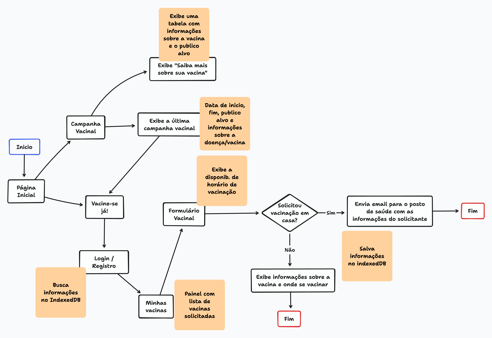
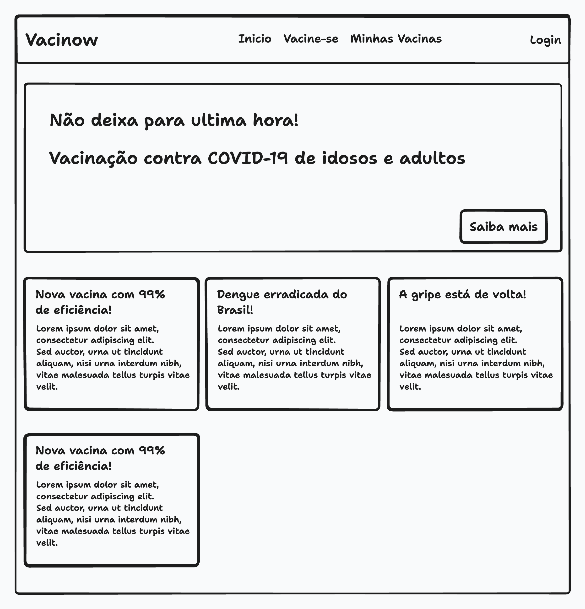
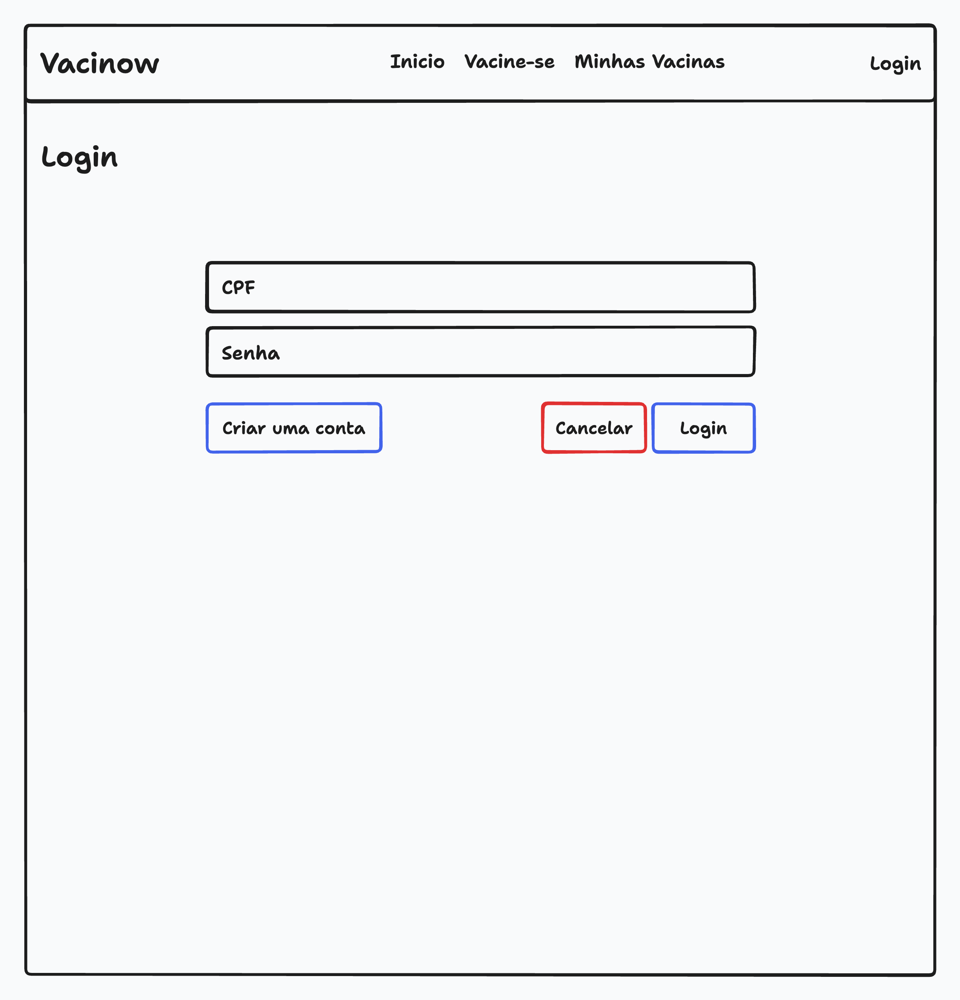
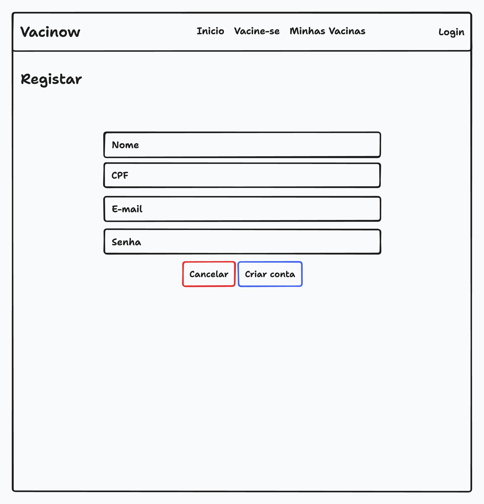
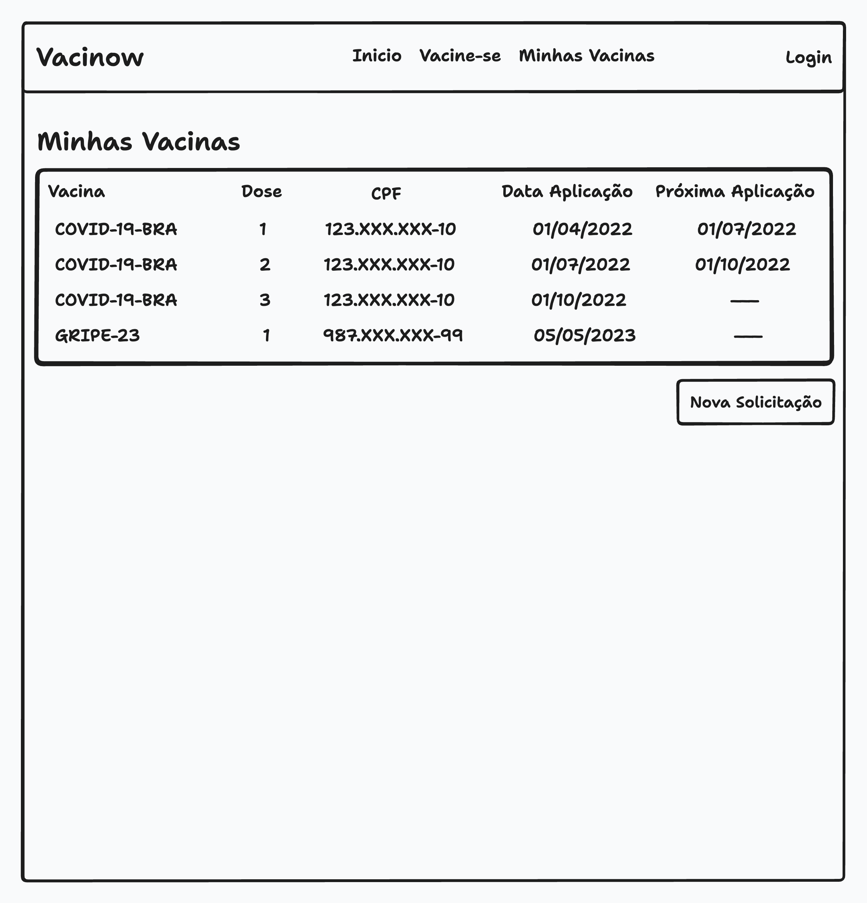
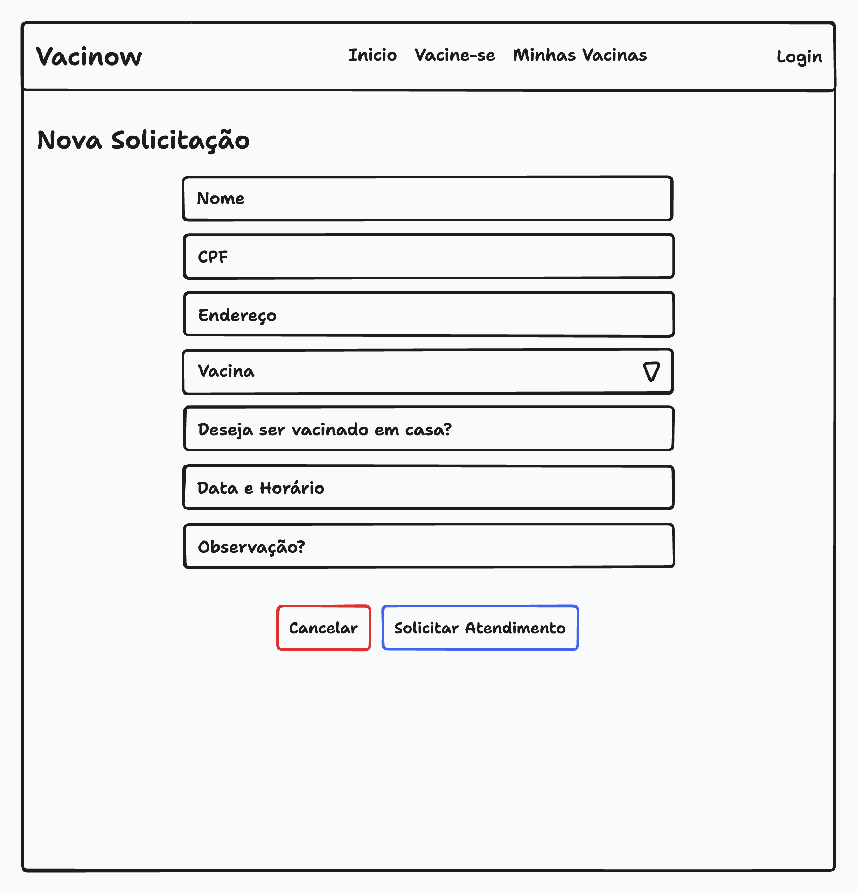

# Projeto de Interface

Visão geral da interação do usuário pelas telas do sistema e protótipo interativo das telas com as funcionalidades que fazem parte do sistema (wireframes).

 Apresente as principais interfaces da plataforma. Discuta como ela foi elaborada de forma a atender os requisitos funcionais, não funcionais e histórias de usuário abordados nas <a href="2-Especificação do Projeto.md"> Documentação de Especificação</a>.

## User Flow

## Wireframes

### Inicio

A Tela Inicial apresenta uma barra de navegação com as principais seções do portal. A área central apresenta um banner com informações a respeito da última campanha de vacinação.

### Login

A tela de login apresenta um formulário simples com dois campos: CPF e Senha, os quais serão usados para autenticar o usuário.

### Registrar

A tela de registro é simples e objetiva. Nela, o usuário irá informar o seu CPF, nome, e-mail e senha.

### Minhas Vacinas

Nessa tela, o usuário verá uma tabela contendo as vacinas que foram solicitadas em sua conta. Por exemplo, caso o usuário solicite uma vacina para seu filho, ela será listada juntamente com as vacinas do titular. Nessa tela, também é possível solicitar um novo agendamento.

### Nova Solicitação

Nessa tela, o usuário irá inserir os dados referentes à pessoa que será vacinada. Ele também poderá optar por ir ao posto de saúde em um horário específico ou receber atendimento em casa.

