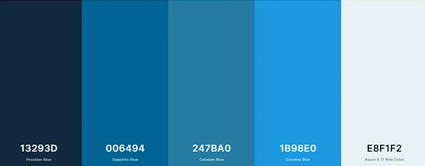
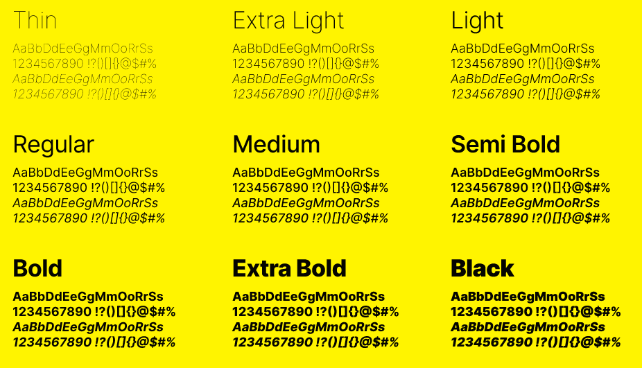

# Template padrão do site

Layout padrão do site (HTML e CSS) que será utilizado em todas as páginas com a definição de identidade visual, aspectos de responsividade e iconografia.

Explique as guias de estilo utilizadas no seu projeto.

## Design

Detalhe os layouts que serão utilizados. Apresente onde será colocado o logo do sistema. Defina os menus padrões, entre outras coisas.

## Cores

A paleta de cores azul e branca foi escolhida para o site de vacinas por transmitir uma sensação de calma, confiança e limpeza. O azul é uma cor associada à saúde e ao bem-estar, enquanto o branco transmite simplicidade. Juntas, essas cores criam um ambiente acolhedor e tranquilizador para os visitantes do site, que buscam informações sobre vacinas e saúde.

## Tipografia

Como fonte vamos utilizar [The Inter typeface family](https://rsms.me/inter/).

As escolhas de fontes em um site são importantes para garantir uma boa legibilidade e hierarquia visual. No caso deste site, o título da página foi escolhido em negrito (bold) para chamar a atenção e destacar o conteúdo principal. Os títulos de seção foram escolhidos em semi-negrito (semi-bold) para diferenciá-los do título da página e do corpo do texto, mas ainda assim destacá-los. Os rótulos de componentes foram escolhidos em fonte leve (light) para não competir com os títulos e o corpo do texto. Por fim, o corpo do texto foi escolhido em fonte regular para garantir uma boa legibilidade e conforto na leitura.

## Iconografia

Os ícones utilizados serão coletados no repositório [Fluent UI System Icons](https://github.com/microsoft/fluentui-system-icons).

Defina os ícones que serão utilizados e suas respectivas funções.

Apresente os estilos CSS criados para cada um dos elementos apresentados.
Outras seções podem ser adicionadas neste documento para apresentar padrões de componentes, de menus, etc.

> **Links Úteis**:
>
> -  [Como criar um guia de estilo de design da Web](https://edrodrigues.com.br/blog/como-criar-um-guia-de-estilo-de-design-da-web/#)
> - [CSS Website Layout (W3Schools)](https://www.w3schools.com/css/css_website_layout.asp)
> - [Website Page Layouts](http://www.cellbiol.com/bioinformatics_web_development/chapter-3-your-first-web-page-learning-html-and-css/website-page-layouts/)
> - [Perfect Liquid Layout](https://matthewjamestaylor.com/perfect-liquid-layouts)
> - [How and Why Icons Improve Your Web Design](https://usabilla.com/blog/how-and-why-icons-improve-you-web-design/)